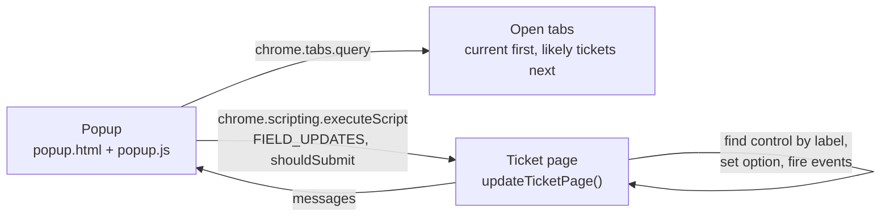

# Ticket Auto Updater

A tiny Chrome extension (Manifest V3) that fills the same four fields on a ticket edit page (Assigned To, Status, Category, Owner) and can press **Update** for you.


<!-- showcase:banner:start -->
> 🧭 Part of **Abdul Raqeeb Khatri's portfolio**: [📂 Hub](https://github.com/Ark310/portfolio) · [🌐 Site](https://ark310.github.io) · [💼 Experience](https://github.com/Ark310/experience)
<!-- showcase:banner:end -->

## Overview

Updating a batch of tickets in an older, table-based support portal meant opening each one and setting the same dropdowns to the same values by hand, dozens of times. This extension does that part. You open the ticket tabs, pick one in the popup, and choose **Fill only** to check the result or **Fill + press Update** to save it.

It needs no portal-specific IDs. Fields are found by their visible label, so it works on classic `<td>Label:</td><td><select>` layouts as well as proper `<label for>` markup.

<!-- showcase:why-impact:start -->
## 💡 Why I Built It

Updating a batch of tickets meant setting the same four dropdowns to the same values by hand, dozens of times.

## 📈 Impact

- Repetitive field updates became a two-click action per ticket.
- Fields are found by their visible label instead of generated IDs, so it survives portal changes and works on other forms.

`4 fields per click` · `0 portal IDs needed`
<!-- showcase:why-impact:end -->

## Features

- **Tab picker**: lists every normal web tab, with the current tab first, then tabs that look like tickets (URL contains `edit_bug.aspx`, or the title mentions "ticket" or "bug").
- **Label-based field lookup**: tries `<label for>` first, then any table cell, label, span or div whose text matches, and takes the next control in the same row.
- **Forgiving option matching**: exact visible text, then option value, then partial text, ignoring case, colons, asterisks and extra spaces.
- **Real change events**: fires `input` and `change`, so the page's own scripts react as if a person had picked the value.
- **Safe dry run**: *Fill only* never submits. *Fill + press Update* finds a button labelled update/save/submit/ok and falls back to `form.requestSubmit()`.
- **Clear feedback**: the popup lists each field it set. If a value isn't in the dropdown, it lists the available options.

## Tech Stack

Plain JavaScript, HTML and CSS · Chrome Extensions Manifest V3 (`tabs`, `scripting`) · no build step, no dependencies.

## Architecture



## Getting Started

1. `git clone https://github.com/Ark310/ticket-auto-updater.git`
2. Open `chrome://extensions`, turn on **Developer mode**, click **Load unpacked** and select the folder.
3. Pin **Ticket Auto Updater**, open a ticket edit page, click the icon, and try **Fill only** first.

## Configuration

Edit `FIELD_UPDATES` at the top of `popup.js`. `labels` lists the label texts to look for and `value` is the option to pick:

```js
const FIELD_UPDATES = [
  { labels: ["Assigned to", "Assigned To"], value: "YOUR_ASSIGNEE_USERNAME" },
  { labels: ["Status"],                     value: "Closed" },
  { labels: ["Category"],                   value: "Data Audit" },
  { labels: ["CSQA Owner", "CSQA Owners"],  value: "YOUR_ASSIGNEE_USERNAME" }
];
const TAB_FILTER_TEXT = "edit_bug.aspx";   // ranks matching tabs higher
```

Reload the extension after editing. `host_permissions` is `<all_urls>` for convenience. Narrow it to your portal's origin for daily use.

## Project Journey

| Date | Step |
|---|---|
| 2026-04-27 12:44 | Manifest and popup: tab picker, *Fill only* and *Fill + press Update* buttons. |
| 2026-04-27 12:52 | `popup.js`: label-based lookup, option matching, change events, submit fallback. |
| 2026-05-26 | Portfolio pass: the hard-coded assignee became a placeholder and the config header was made generic. |
| 2026-09 | v3 rebuild: dated history and this README. |

**Design choice:** matching on visible labels instead of element IDs made the extension robust to the portal's generated IDs and reusable for other forms. The cost is that it relies on the label text staying stable.

History note: never under git. Commits were rebuilt from the original files' modification times, with the personal username replaced by a placeholder.

## 🤖 Built with AI

- **Original extension (April 2026):** written with ChatGPT (the config comment still gives example values the way a chat answer would). ChatGPT conversation logs were not kept, so there are no session counts.
- **Claude Code:** the May–June 2026 portfolio pass (placeholder config) and the September 2026 rebuild (dated history, sanitization scan: clean, this README).
- **Commits:** 4, each with a `Co-Authored-By: Claude` trailer. **Tests:** none. `node --check popup.js` passes.

## License

MIT, see [LICENSE](LICENSE).

<!-- showcase:footer:start -->
---

<p align="center"><a href="https://github.com/Ark310/portfolio">← Back to the portfolio hub</a> · <a href="https://ark310.github.io">Interactive site</a> · <a href="https://github.com/Ark310/experience">Experience</a></p>

**Related projects:** [Report Downloader](https://github.com/Ark310/report-downloader) · [Incident Report Scraper](https://github.com/Ark310/incident-report-scraper) · [Portal Account De-Activator](https://github.com/Ark310/portal-account-deactivator)
<!-- showcase:footer:end -->

## Author

**Abdul Raqeeb Khatri** · [GitHub @Ark310](https://github.com/Ark310)
